# Rails Profiler — UI Guide

The Rails Profiler injects a debug toolbar into every HTML page and provides a full web dashboard to inspect past requests in detail.

## Toolbar

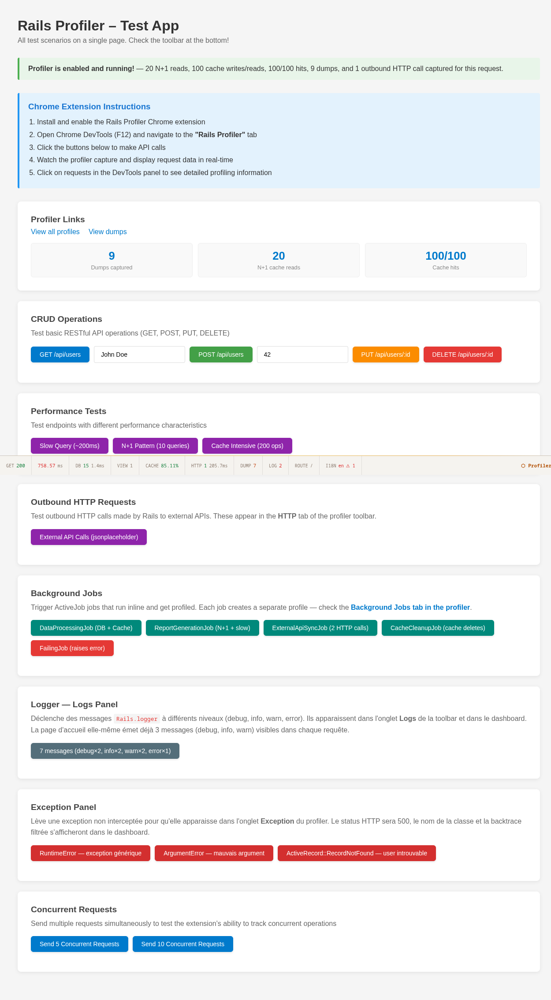

The toolbar appears as a fixed bar at the bottom of every profiled HTML page. It shows key metrics for the current request at a glance:

| Pill | Color coding |
|------|-------------|
| **HTTP status** | Green (2xx) / Yellow (3xx) / Red (4xx–5xx) |
| **Duration** | Green (<100ms) / Yellow (<500ms) / Red (≥500ms) |
| **DB** | Query count + warning if slow queries detected |
| **VIEW** | Template render count |
| **CACHE** | Hit rate percentage |
| **HTTP** | Outbound HTTP request count |
| **LOG** | Log message count |
| **DUMP** | Number of `Profiler.dump()` calls |
| **ROUTE** | Matched route count |
| **I18N** | Translation lookup count |

Clicking the **Profiler** logo at the right opens the full profile in the dashboard.

The toolbar updates itself when its profile is saved again after the page was sent, for instance
when an outgoing HTTP request started in a background thread finishes. It checks with short
requests, often at first and then every 30 seconds, not while the tab is hidden, and stops after
10 minutes without a change; see "Performance" in the README.

---

## Profiler Selector (Cluster)

When the master profiler has slave instances connected, a **Profiler** dropdown appears at the top of the `/_profiler` interface.

- **Local (master)** — shows profiles captured by the current instance (default)
- **\<slave name\>** — proxies all data through the master to the selected slave; the rest of the UI is identical

Selecting a slave updates all profile lists, detail views, and actions so they operate on the slave's data. The selection is remembered for the current browser session (sessionStorage).

Slaves appear as `(offline)` and cannot be selected if their last heartbeat was more than 60 seconds ago.

---

## Profile List

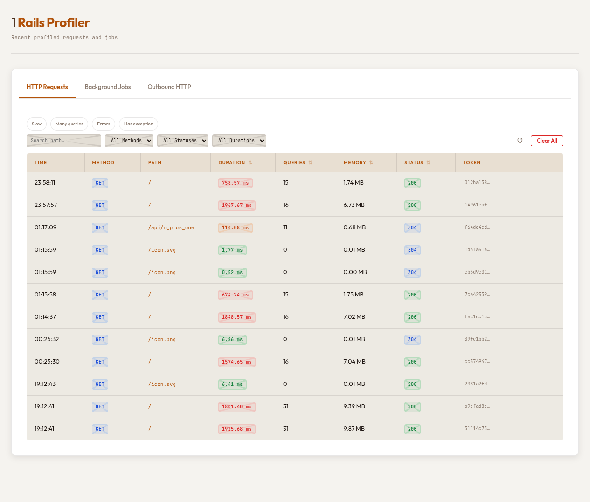

Navigate to `/_profiler` to see all recorded profiles. The list is split into four sections:

- **HTTP Requests** — regular web requests
- **Background Jobs** — Sidekiq / ActiveJob executions
- **Console** — expressions evaluated in `rails console`
- **Outbound HTTP** — external API calls grouped separately

### Filters

- **Quick presets**: Slow, Many queries, Errors, Has exception
- **Search**: filter by path substring
- **Method**: GET, POST, PUT, PATCH, DELETE
- **Status**: 2xx, 3xx, 4xx, 5xx
- **Duration**: <100ms, ≥100ms, ≥500ms

### Columns

| Column | Description |
|--------|-------------|
| Time | Request timestamp |
| Method | HTTP verb badge |
| Path | Clickable link to profile detail |
| Duration | Color-coded response time |
| Queries | SQL query count |
| Allocations | Objects allocated while the request ran, by the whole process (other threads included on a multi-threaded server) |
| Status | HTTP status badge |
| Token | Unique profile identifier (click to copy) |

Column headers marked with ⇅ are sortable.

---

## Profile Dashboard

Clicking any row opens the **Profile Details** view with a tabbed interface. The header always shows: `METHOD PATH`, Duration, Status, and Allocations.

### Request tab

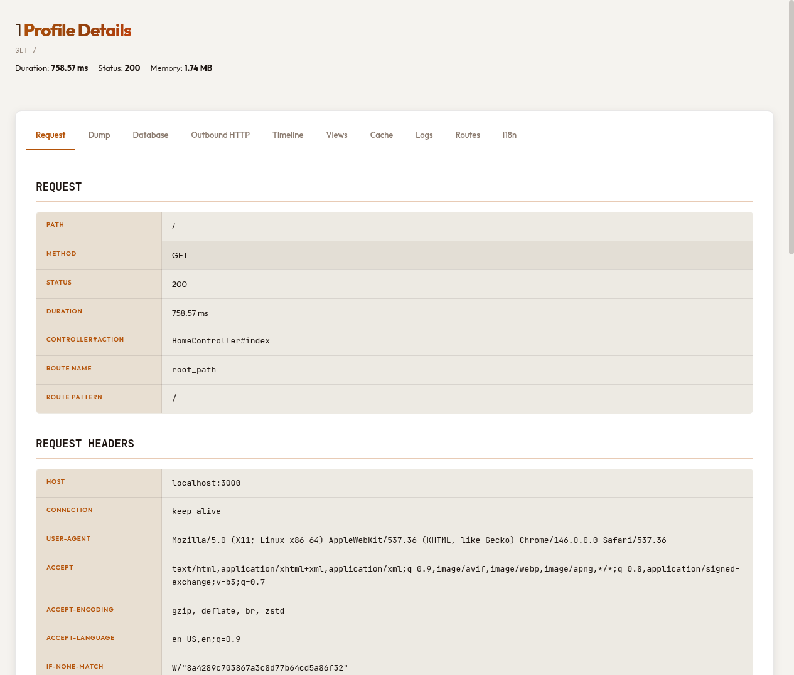

Shows the full HTTP context:

- **Path, Method, Status, Duration** — core request metadata
- **Controller#Action** — the Rails controller and action that handled it
- **Route Name & Pattern** — matched named route and URL pattern
- **Request Headers** — filtered list of relevant headers
- **Response Headers** — full response header set
- **Response Body** — raw body (compressed bodies are decoded automatically)
- **Curl Command** — auto-generated `curl` command to replay the request

---

### Dump tab

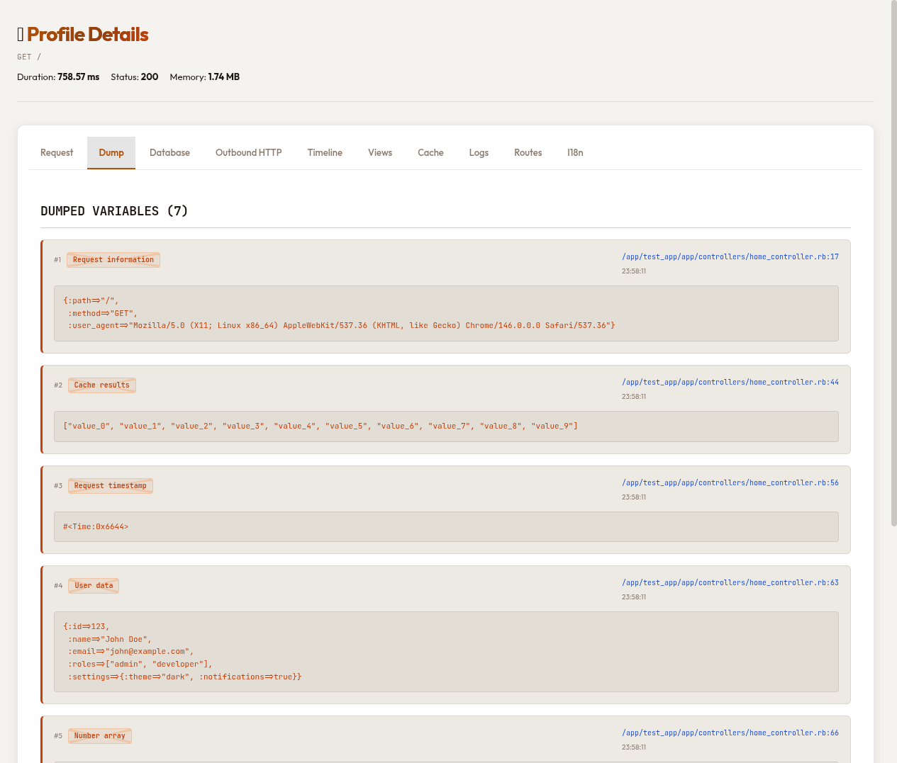

Shows all variables captured via `Profiler.dump()` during the request, in call order.

Each entry displays:
- **Number** — call order (#1, #2, …)
- **Label** — optional human-readable label
- **File:line** — exact source location as a clickable link
- **Timestamp** — when the dump was captured
- **Value** — pretty-printed Ruby object

**Usage in code:**
```ruby
# Basic dump
Profiler.dump(@user)

# With a label
Profiler.dump(@posts, "Posts for current page")

# Chainable — returns the value
user = Profiler.dump(User.find(params[:id]), "Current user")
```

---

### Database tab

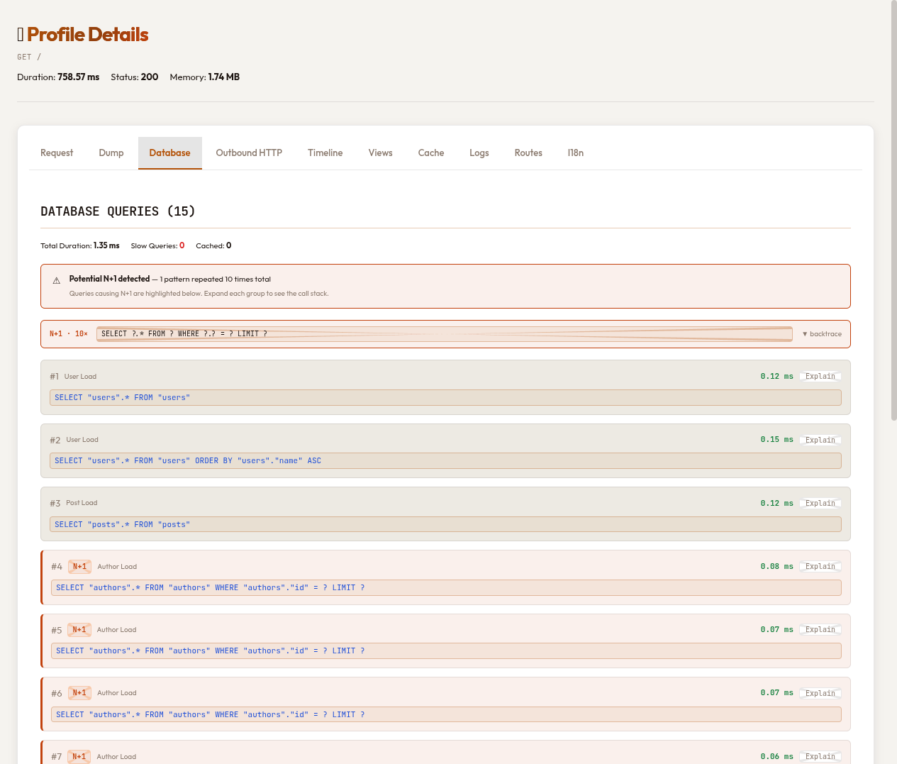

Displays all SQL queries executed during the request:

- **Summary**: total count, total duration, slow query count, cached query count
- **N+1 detection**: automatic warning when the same parameterized query is repeated ≥3 times, with the pattern highlighted and grouped
- **Query list**: each query shows:
  - Number, model name, execution time (color-coded)
  - Parameterized SQL (bind values replaced with `?`)
  - **N+1** badge when part of a detected pattern
  - **Explain** button — runs `EXPLAIN ANALYZE` inline and displays the query plan

Slow queries (above `slow_query_threshold`, default 100ms) are highlighted in red.

The **Explain** button only explains read-only queries, in a transaction always rolled back; any other query is refused with the reason. See [Explaining a query](../README.md#explaining-a-query).

---

### Timeline tab (Flame Graph)

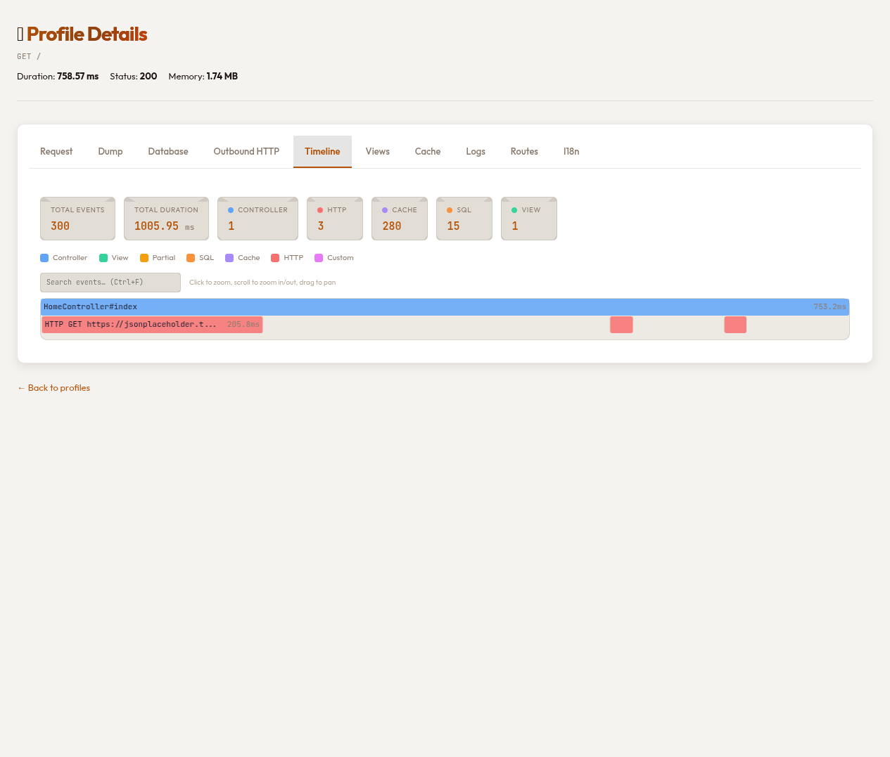

A hierarchical flame graph of all instrumented events during the request:

- **Summary chips**: total events, total duration, count per category
- **Legend**: Controller (blue), View (green), Partial (amber), SQL (orange), Cache (purple), HTTP (red), Custom (pink)
- **Interactive canvas**:
  - Click a block to zoom in
  - Scroll to zoom in/out
  - Drag to pan
  - Hover for tooltip with name, duration, and payload
- **Search** (Ctrl+F): highlight matching events across the graph
- **Breadcrumbs**: navigation trail when zoomed in

**Custom instrumentation** via `Profiler.measure()`:
```ruby
result = Profiler.measure("payment.stripe_charge", metadata: { amount: 1000 }) do
  Stripe::Charge.create(amount: 1000, currency: "usd")
end
```

Custom events appear as pink blocks nested at the correct position in the hierarchy.

---

### Views tab

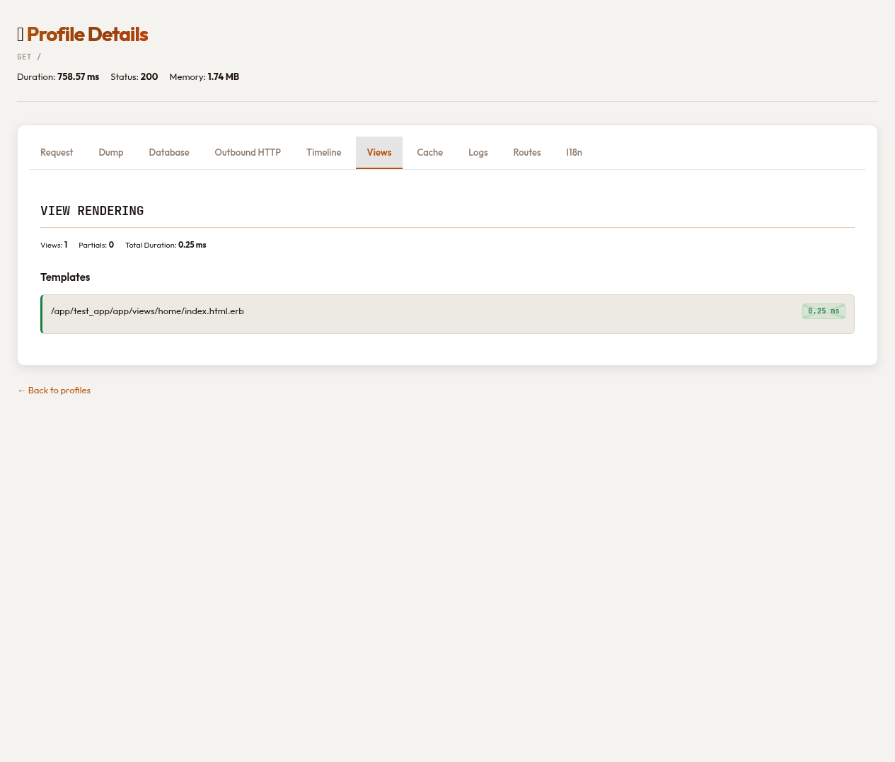

Shows template and partial rendering:

- **Summary**: view count, partial count, total render duration
- **Templates**: each rendered template with its file path and duration
- **Partials**: each rendered partial with its file path and duration

Duration badges are color-coded: green (<10ms), yellow (<50ms), red (≥50ms).

---

### Cache tab

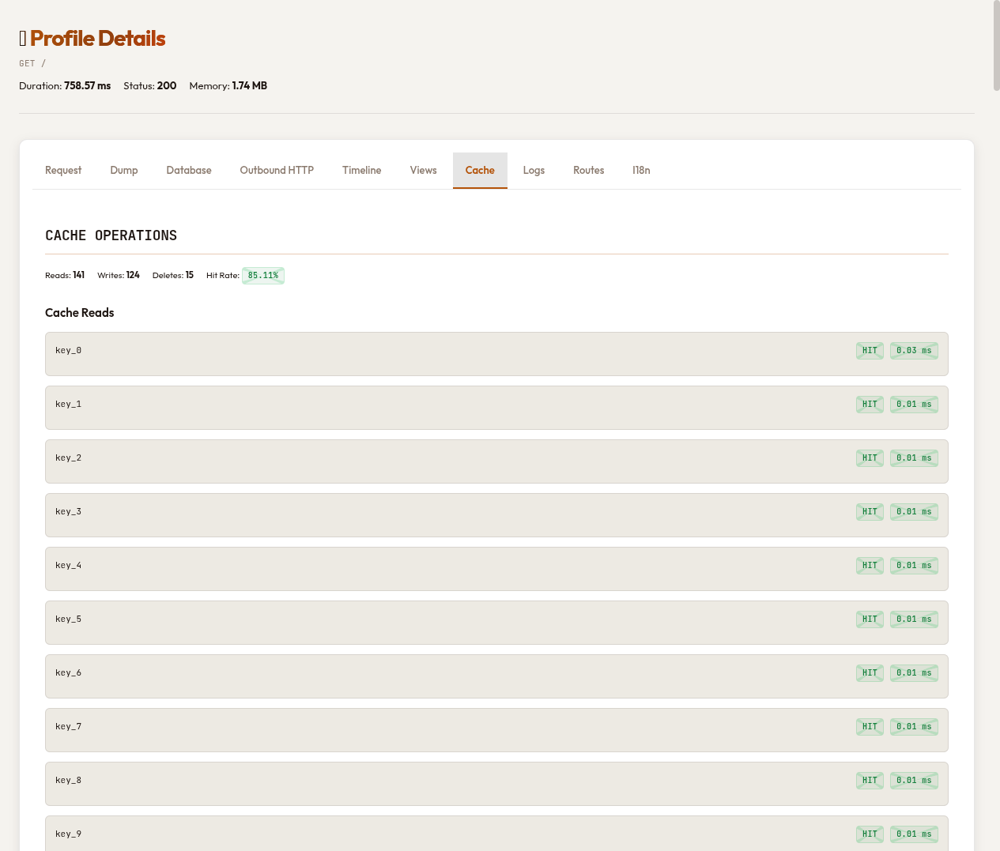

Monitors all Rails cache operations:

- **Summary**: read count, write count, delete count, hit rate %
- **Cache Reads**: each key with HIT/MISS badge and duration
- **Cache Writes**: each key written with duration
- **Cache Deletes**: each key deleted

Hit rate is color-coded: green (≥80%), yellow (≥50%), red (<50%).

---

### Logs tab

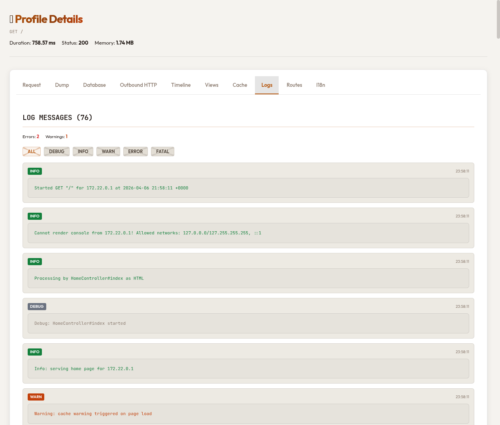

Captures all log output generated during the request:

- **Summary**: error count, warning count
- **Level filter**: ALL, DEBUG, INFO, WARN, ERROR, FATAL
- **Log entries**: timestamp, level badge (color-coded), message

Level badge colors: DEBUG (gray), INFO (green), WARN (yellow), ERROR (red), FATAL (dark red).

---

### Outbound HTTP tab

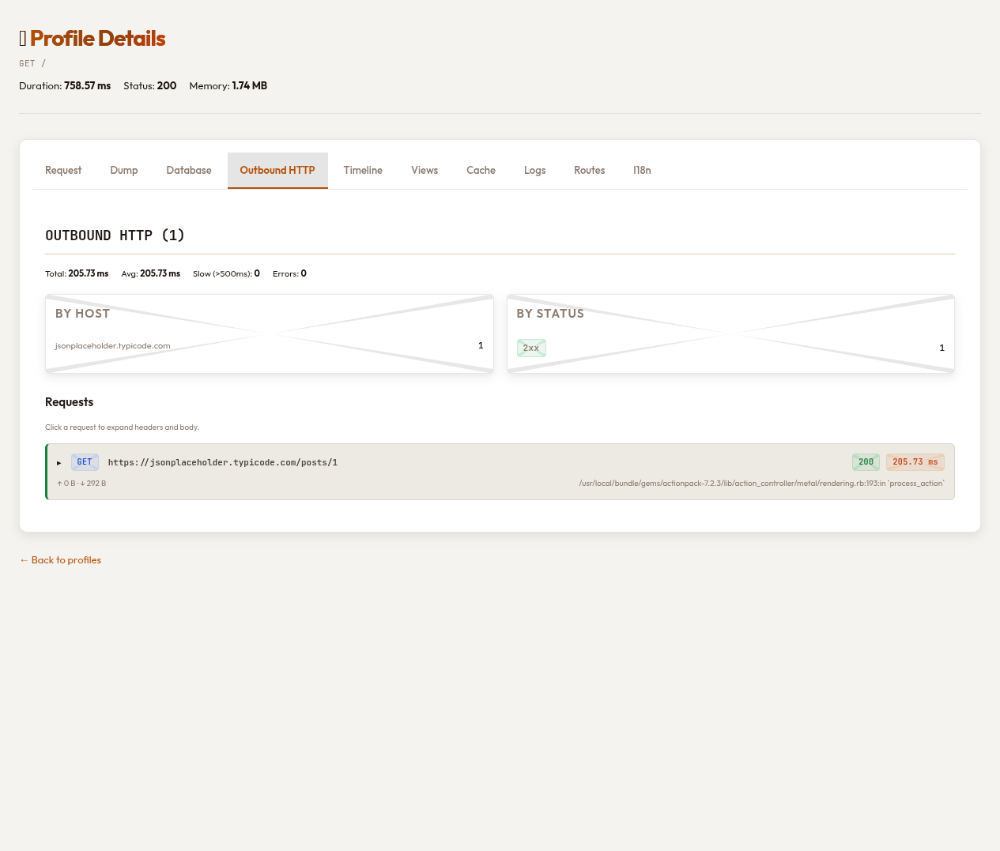

Tracks all outbound HTTP calls made via `Net::HTTP`:

- **Summary**: total count, total duration, average duration, slow count (>500ms), error count
- **By Host**: request count grouped by domain
- **By Status**: count grouped by HTTP status class (2xx, 3xx, 4xx, 5xx)
- **Request list**: each request shows method, URL, status, duration, request/response sizes
  - Click to expand headers and body

---

### Exception tab

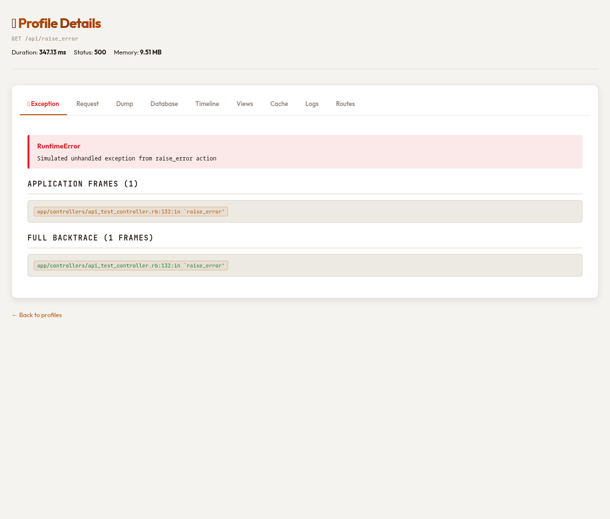

Automatically selected when an exception occurred during the request:

- **Exception class** and message (highlighted in red)
- **Application Frames**: only frames from your application code
- **Full Backtrace**: complete stack trace

The tab only appears when an exception was captured. If no exception occurred, the tab shows "No exception recorded."

---

### Routes tab

Shows all routes registered in the Rails app:

- Matched route highlighted at the top
- Full route table: HTTP verb, URL pattern, controller#action, route name

The profile keeps only the route its request matched. The table is the one of the process that
serves the page, as it is now (rebuilt when the routes are reloaded in development). Likewise, the
Env tab of an HTTP profile shows the current `ENV` of that process, not the `ENV` as it was during
the request; the profile of a job, a console expression or a test keeps the `ENV` of the process it
ran in.

---

### I18n tab

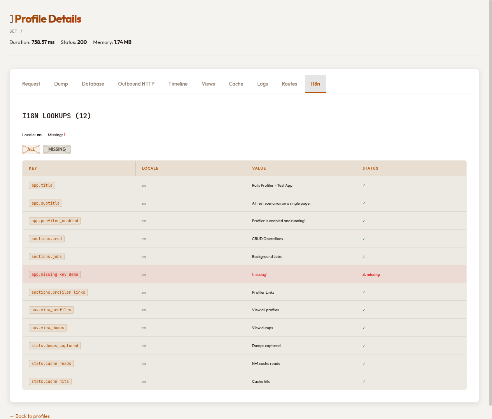

Tracks all translation lookups during the request:

- **Summary**: total lookup count, locale, missing key count
- **Filter**: ALL / MISSING only
- **Table**: key, locale, resolved value, status (✓ found / ⚠ missing)

Missing keys are highlighted in red — useful for catching untranslated strings before they reach production.

---

## Background Jobs

Background jobs (Sidekiq, ActiveJob) are profiled separately and appear under the **Background Jobs** tab in the profile list. Each job profile contains the same tabs as an HTTP profile, with an additional **Job** section showing queue name, job class, arguments, status, and error details for failed jobs.

---

## Console Profiles

Expressions evaluated in `rails console` are profiled automatically when `track_console: true` (default) and appear under the **Console** tab.

### Columns

| Column | Description |
|--------|-------------|
| Time | When the expression was evaluated |
| Expression | The Ruby expression (truncated to 60 chars) |
| Duration | Evaluation time, color-coded |
| SQL | Number of SQL queries executed |
| Status | ✓ OK or ✗ Error |
| Token | Unique profile identifier (click to copy) |

Column headers marked with ⇅ are sortable. The Expression column is filterable by substring; a Status filter lets you show only errors or successes.

### Env overrides

Environment variable overrides set via the profiler UI or MCP tools are applied before each expression evaluation, so changes take effect immediately in the open console without a restart. They are applied only outside production and while the profiler is enabled, unless `config.apply_env_overrides_when_disabled = true` (never in production); see "Environment variable overrides" in the README.
